# Architecture Diagrams

## 🎨 Option 1: Mermaid Diagram (GitHub Compatible)

Copy this to a file with `.mermaid` extension or paste in GitHub markdown:

```mermaid
graph TB
    subgraph Internet
        Users[👥 Users]
    end

    subgraph "AWS Cloud - Region: ap-south-1"
        subgraph "VPC (10.0.0.0/16)"
            subgraph "Public Subnets (2 AZs)"
                ALB[Application Load Balancer<br/>Path-based routing<br/>/ → Frontend<br/>/api/* → Backend]
                NAT[NAT Gateway]
                IGW[Internet Gateway]
            end

            subgraph "Private Subnets (2 AZs)"
                subgraph "ECS Fargate Cluster"
                    Frontend[Frontend Service<br/>Next.js on port 3000<br/>2 tasks]
                    Backend[Backend Service<br/>FastAPI on port 8000<br/>2 tasks]
                end
            end
        end

        subgraph "Container Registry"
            ECR[Amazon ECR<br/>Docker Images<br/>SHA-tagged versions]
        end

        subgraph "State Management"
            S3[S3 Bucket<br/>Terraform State]
            DynamoDB[DynamoDB<br/>State Lock]
        end

        subgraph "Monitoring"
            CloudWatch[CloudWatch Logs<br/>Container logs]
        end
    end

    subgraph "CI/CD Pipeline"
        GitHub[GitHub Repository<br/>Code + IaC]
        Actions[GitHub Actions<br/>Automated Pipeline]
    end

    Users -->|HTTPS/HTTP| ALB
    ALB -->|Route /| Frontend
    ALB -->|Route /api/*| Backend
    Frontend -.->|Pull images| ECR
    Backend -.->|Pull images| ECR
    Frontend -.->|Logs| CloudWatch
    Backend -.->|Logs| CloudWatch
    NAT -->|Internet access| Frontend
    NAT -->|Internet access| Backend
    IGW -->|Public traffic| ALB

    GitHub -->|Push to main| Actions
    Actions -->|Build & Push| ECR
    Actions -->|Update| Frontend
    Actions -->|Update| Backend
    Actions -.->|Read/Write| S3
    Actions -.->|Lock| DynamoDB

    style Users fill:#e1f5ff
    style ALB fill:#ff9900
    style Frontend fill:#00a4bd
    style Backend fill:#00a4bd
    style ECR fill:#ff9900
    style GitHub fill:#24292e
    style Actions fill:#2088ff
```



---

## 🎨 Option 2: ASCII Art (Terminal Friendly)

```
                          ┌─────────────┐
                          │   Internet  │
                          │    Users    │
                          └──────┬──────┘
                                 │ HTTP/HTTPS
                                 │
┌────────────────────────────────┼────────────────────────────────┐
│ AWS Cloud (ap-south-1)         │                                │
│                                 ▼                                │
│  ┌─────────────────────────────────────────────────────────┐   │
│  │ VPC (10.0.0.0/16)                                       │   │
│  │                                                          │   │
│  │  ┌──────────────────────────────────────────────────┐  │   │
│  │  │ Public Subnets (AZ-a, AZ-b)                      │  │   │
│  │  │                                                   │  │   │
│  │  │  ┌────────────────────────────────────┐          │  │   │
│  │  │  │ Application Load Balancer          │          │  │   │
│  │  │  │ • Path-based routing               │          │  │   │
│  │  │  │ • / → Frontend                     │          │  │   │
│  │  │  │ • /api/* → Backend                 │          │  │   │
│  │  │  └─────────┬──────────────┬───────────┘          │  │   │
│  │  │            │              │                       │  │   │
│  │  │  ┌─────────────┐   ┌──────────┐                 │  │   │
│  │  │  │   IGW       │   │ NAT GW   │                  │  │   │
│  │  │  └─────────────┘   └──────────┘                  │  │   │
│  │  └───────────────────────┼──────────────────────────┘  │   │
│  │                          │ Internet Access              │   │
│  │  ┌───────────────────────┼──────────────────────────┐  │   │
│  │  │ Private Subnets (AZ-a, AZ-b)                      │  │   │
│  │  │                       │                            │  │   │
│  │  │  ┌────────────────────┼────────────────────────┐  │  │   │
│  │  │  │ ECS Fargate Cluster│                        │  │  │   │
│  │  │  │                    ▼                        │  │  │   │
│  │  │  │  ┌─────────────────────────────┐           │  │  │   │
│  │  │  │  │   Frontend Service          │           │  │  │   │
│  │  │  │  │   Next.js - Port 3000       │◄──────────┼──┼──┼───┐
│  │  │  │  │   Tasks: 2                  │           │  │  │   │
│  │  │  │  └─────────────────────────────┘           │  │  │   │
│  │  │  │                                             │  │  │   │
│  │  │  │  ┌─────────────────────────────┐           │  │  │   │
│  │  │  │  │   Backend Service           │           │  │  │   │
│  │  │  │  │   FastAPI - Port 8000       │◄──────────┼──┼──┼───┤
│  │  │  │  │   Tasks: 2                  │           │  │  │   │
│  │  │  │  └─────────────────────────────┘           │  │  │   │
│  │  │  │                                             │  │  │   │
│  │  │  └─────────────────────────────────────────────┘  │  │   │
│  │  └──────────────────────────────────────────────────┘  │   │
│  └─────────────────────────────────────────────────────────┘   │
│                                                                 │
│  ┌─────────────────────┐     ┌──────────────────┐             │
│  │  Amazon ECR         │     │  CloudWatch Logs │             │
│  │  Docker Images      │     │  Container logs  │             │
│  │  SHA-tagged         │     └──────────────────┘             │
│  └─────────────────────┘                                       │
│                                                                 │
│  ┌─────────────────────┐     ┌──────────────────┐             │
│  │  S3 Bucket          │     │  DynamoDB        │             │
│  │  Terraform State    │     │  State Lock      │             │
│  └─────────────────────┘     └──────────────────┘             │
│                                                                 │
└─────────────────────────────────────────────────────────────────┘

┌─────────────────────────────────────────────────────────────────┐
│ CI/CD Pipeline                                                  │
│                                                                 │
│  GitHub Repo  ──push──▶  GitHub Actions                        │
│                              │                                  │
│                              ├──▶ Build Docker Images           │
│                              │                                  │
│                              ├──▶ Push to ECR ──────────────────┼──┐
│                              │                                  │  │
│                              └──▶ Update ECS Services ──────────┼──┘
│                                                                 │
└─────────────────────────────────────────────────────────────────┘
```

---

## 🎨 Option 3: Python Diagrams (Creates PNG)

Install and run this Python script to generate a professional diagram:

```bash
# Install diagrams library
pip install diagrams

# Create the diagram
python3 architecture_diagram.py
```

**File: `architecture_diagram.py`**

```python
from diagrams import Diagram, Cluster, Edge
from diagrams.aws.compute import ECS, ECR, Fargate
from diagrams.aws.network import ALB, VPC, InternetGateway, NATGateway
from diagrams.aws.management import Cloudwatch
from diagrams.aws.storage import S3
from diagrams.aws.database import Dynamodb
from diagrams.onprem.vcs import Github
from diagrams.onprem.ci import GithubActions
from diagrams.generic.device import Mobile

with Diagram("DevOps Project Architecture", show=False, direction="TB"):
    users = Mobile("Users")

    with Cluster("CI/CD Pipeline"):
        github = Github("GitHub\nRepository")
        actions = GithubActions("GitHub Actions\nCI/CD")
        github >> Edge(label="push") >> actions

    with Cluster("AWS Cloud - ap-south-1"):
        ecr = ECR("Amazon ECR\nDocker Images")
        logs = Cloudwatch("CloudWatch\nLogs")

        with Cluster("State Management"):
            s3 = S3("S3\nTerraform State")
            dynamo = Dynamodb("DynamoDB\nState Lock")

        with Cluster("VPC (10.0.0.0/16)"):
            igw = InternetGateway("Internet\nGateway")

            with Cluster("Public Subnets"):
                alb = ALB("Application\nLoad Balancer")
                nat = NATGateway("NAT\nGateway")

            with Cluster("Private Subnets"):
                with Cluster("ECS Fargate Cluster"):
                    frontend = ECS("Frontend\nNext.js:3000")
                    backend = ECS("Backend\nFastAPI:8000")

    # User flow
    users >> Edge(label="HTTP/HTTPS") >> igw >> alb
    alb >> Edge(label="/ path") >> frontend
    alb >> Edge(label="/api/* path") >> backend

    # CI/CD flow
    actions >> Edge(label="build & push") >> ecr
    actions >> Edge(label="deploy") >> frontend
    actions >> Edge(label="deploy") >> backend
    actions >> Edge(label="state", style="dotted") >> s3
    actions >> Edge(label="lock", style="dotted") >> dynamo

    # Container flow
    ecr >> Edge(style="dotted") >> frontend
    ecr >> Edge(style="dotted") >> backend
    frontend >> Edge(label="logs", style="dotted") >> logs
    backend >> Edge(label="logs", style="dotted") >> logs

    # NAT for outbound
    nat >> Edge(style="dotted") >> frontend
    nat >> Edge(style="dotted") >> backend
```

**Run:**
```bash
python3 architecture_diagram.py
```

This creates `devops_project_architecture.png` in the current directory!

---

## 🎨 Option 4: Draw.io / Diagrams.net Instructions

1. Go to https://app.diagrams.net/
2. Create new diagram
3. Use these AWS icons:
   - Search "AWS" in shape library
   - Drag and drop components

**Components to add:**
```
Top Layer:
- Users icon

AWS Cloud box:
  VPC box:
    Public Subnets box:
      - Application Load Balancer icon
      - Internet Gateway icon
      - NAT Gateway icon

    Private Subnets box:
      - ECS icon (Frontend)
      - ECS icon (Backend)

  - ECR icon
  - CloudWatch icon
  - S3 icon
  - DynamoDB icon

CI/CD box:
  - GitHub icon
  - GitHub Actions icon
```

**Connections:**
- Users → Internet Gateway → ALB
- ALB → Frontend (label: "/")
- ALB → Backend (label: "/api/*")
- ECR → Frontend (dotted)
- ECR → Backend (dotted)
- GitHub → GitHub Actions → ECR
- GitHub Actions → ECS services

---

## 🎨 Option 5: PowerPoint/Slides Template

Use these shapes in PowerPoint or Google Slides:

```
Slide Layout:

┌────────────────────────────────────────┐
│         Internet (Blue Cloud)          │
└───────────────┬────────────────────────┘
                │
┌───────────────┴────────────────────────┐
│    AWS Cloud (Orange Rectangle)        │
│                                         │
│  ┌─────────────────────────────────┐   │
│  │   VPC (Green Rectangle)         │   │
│  │                                 │   │
│  │  [Public]    [Private]         │   │
│  │  - ALB       - Frontend         │   │
│  │  - NAT       - Backend          │   │
│  │                                 │   │
│  └─────────────────────────────────┘   │
│                                         │
│  [ECR] [CloudWatch] [S3] [DynamoDB]   │
└─────────────────────────────────────────┘

┌─────────────────────────────────────────┐
│    GitHub → Actions → AWS (Arrows)      │
└─────────────────────────────────────────┘
```

**Color scheme:**
- Internet: Light Blue (#E1F5FF)
- AWS: Orange (#FF9900)
- VPC: Light Green (#7FFF00)
- ECS: Dark Blue (#00A4BD)
- GitHub: Black (#24292E)
- Actions: Blue (#2088FF)

---

## 🎨 Quick Hand-Drawn Option

For demo, you can quickly draw on whiteboard or paper:

```
┌─────────┐
│ Internet│
└────┬────┘
     │
┌────▼─────────────────────────┐
│  AWS                          │
│                               │
│  ┌─────────────────────────┐ │
│  │  Public    │  Private   │ │
│  │            │            │ │
│  │  [ALB] ────┼──→[Front]  │ │
│  │      └─────┼──→[Back]   │ │
│  │            │            │ │
│  └─────────────────────────┘ │
│                               │
│  [ECR] [Logs] [State]        │
└───────────────────────────────┘
         ▲
         │
    [GitHub Actions]
```

---

## 📝 Which Format Should You Use?

### For Demo Presentation:
- **PowerPoint/Draw.io** - Most professional, easy to present
- **Hand-drawn** - Personal touch, shows understanding

### For Documentation:
- **Mermaid** - Renders in GitHub README
- **Python diagrams** - Professional PNG for docs

### For Quick Reference:
- **ASCII** - Copy-paste anywhere

---

## 🚀 Quick Start: Best Option for Demo

**I recommend: Draw.io (3 minutes)**

1. Go to https://app.diagrams.net/
2. File → New → Blank Diagram
3. Click "More Shapes" → Search "AWS 19"
4. Enable AWS icons
5. Drag these:
   - VPC
   - Application Load Balancer
   - ECS (x2 for frontend/backend)
   - ECR
6. Add arrows and labels
7. Export as PNG
8. Done!

---

## 💾 Files to Save

I can generate these files for you:

```bash
# Mermaid diagram
architecture.mermaid

# Python script
architecture_diagram.py

# ASCII art
architecture.txt
```

Would you like me to create any of these files?
